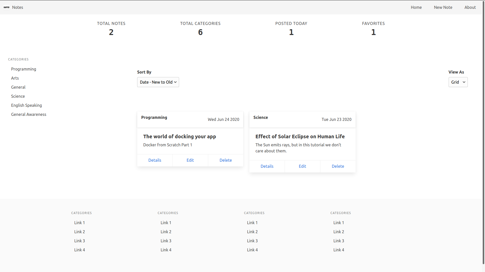

# Notes App

ReactJS app to learn to perform different actions on notes.

## Finished Product

## The Planning

The first step would be to draw the rough diagram of the UI of the app, we will be using the following tools:

| Tool        | Description                       |
| ----------- | --------------------------------- |
| draw.io     | Drawing sketch for the ui of app  |
| json-server | for backend and storing the notes |
| reactjs     | For front end of app              |
| redux       | for data management in app        |
| redux-thunk | for async redux                   |
| bulma.io    | for styling the app               |

The phase started from drawing the app, and it went on till the app completes, the diagram file can be found in diagrams folder of current repository, please check it out for more info.

The server could be found in server directory, it is easy to get started, just `yarn install` in the server directory and `yarn start`.

The main point of the app was to learn a proper architecture and a more complex ui interactions, and it is not the perfect or not to the limit of improvement i wanted to make, i worked on this app for more than 3 days, and now i want to do something else, so i am just finishing the project, I might work on this app in the future, but not for sure. Thanks.

You are free to use and modify any part of the app, as you like. There is no licence or no restrictions on it. Go ahead and try to clone the repo and edit it.

Just for fun, Repeat the step for more than 2 times:

1. Clone the repo
2. Install the packages.
3. Run the App in the browser
4. Remove the repo.
5. Repeat from step 1.

And finally, report the internet bandwidth usage in the entire process to me at: [dev.jayantmalik@gmail.com](mailto://dev.jayantmalik@gmail.com)
